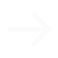
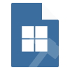

# Flax-Editor-Icons

Ever-growing repository of [Flax Engine](https://github.com/FlaxEngine/FlaxEngine) icons.
 

## Icons

| Icon | Name | Category |
|------|------|----------|
|  | [AddActor](https://github.com/GasimoCodes/Flax-Editor-Icons/blob/main/Icons/Actions/Action=AddActor.png) | Actions/Action |
|  | [Duplicate](https://github.com/GasimoCodes/Flax-Editor-Icons/blob/main/Icons/Actions/Action=Duplicate.png) | Actions/Action |
|  | [Animation7](https://github.com/GasimoCodes/Flax-Editor-Icons/blob/main/Icons/Actions/Animation=Animation7.png) | Actions/Animation |
|  | [Mute](https://github.com/GasimoCodes/Flax-Editor-Icons/blob/main/Icons/Actions/Animation=Mute.png) | Actions/Animation |
|  | [Pause](https://github.com/GasimoCodes/Flax-Editor-Icons/blob/main/Icons/Actions/Animation=Pause.png) | Actions/Animation |
|  | [Play](https://github.com/GasimoCodes/Flax-Editor-Icons/blob/main/Icons/Actions/Animation=Play.png) | Actions/Animation |
|  | [Record](https://github.com/GasimoCodes/Flax-Editor-Icons/blob/main/Icons/Actions/Animation=Record.png) | Actions/Animation |
|  | [Solo](https://github.com/GasimoCodes/Flax-Editor-Icons/blob/main/Icons/Actions/Animation=Solo.png) | Actions/Animation |
|  | [StepBackward](https://github.com/GasimoCodes/Flax-Editor-Icons/blob/main/Icons/Actions/Animation=StepBackward.png) | Actions/Animation |
|  | [StepForward](https://github.com/GasimoCodes/Flax-Editor-Icons/blob/main/Icons/Actions/Animation=StepForward.png) | Actions/Animation |
|  | [Add](https://github.com/GasimoCodes/Flax-Editor-Icons/blob/main/Icons/Actions/Generic=Add.png) | Actions/Generic |
|  | [Backward](https://github.com/GasimoCodes/Flax-Editor-Icons/blob/main/Icons/Actions/Generic=Backward.png) | Actions/Generic |
|  | [Down](https://github.com/GasimoCodes/Flax-Editor-Icons/blob/main/Icons/Actions/Generic=Down.png) | Actions/Generic |
|  | [Forward](https://github.com/GasimoCodes/Flax-Editor-Icons/blob/main/Icons/Actions/Generic=Forward.png) | Actions/Generic |
|  | [Hammer](https://github.com/GasimoCodes/Flax-Editor-Icons/blob/main/Icons/Actions/Generic=Hammer.png) | Actions/Generic |
|  | [HammerBox](https://github.com/GasimoCodes/Flax-Editor-Icons/blob/main/Icons/Actions/Generic=HammerBox.png) | Actions/Generic |
|  | [HammerGrid](https://github.com/GasimoCodes/Flax-Editor-Icons/blob/main/Icons/Actions/Generic=HammerGrid.png) | Actions/Generic |
|  | [HammerGridPersp](https://github.com/GasimoCodes/Flax-Editor-Icons/blob/main/Icons/Actions/Generic=HammerGridPersp.png) | Actions/Generic |
|  | [OpenFolder](https://github.com/GasimoCodes/Flax-Editor-Icons/blob/main/Icons/Actions/Generic=OpenFolder.png) | Actions/Generic |
|  | [Package](https://github.com/GasimoCodes/Flax-Editor-Icons/blob/main/Icons/Actions/Generic=Package.png) | Actions/Generic |
|  | [Redo](https://github.com/GasimoCodes/Flax-Editor-Icons/blob/main/Icons/Actions/Generic=Redo.png) | Actions/Generic |
|  | [Remove](https://github.com/GasimoCodes/Flax-Editor-Icons/blob/main/Icons/Actions/Generic=Remove.png) | Actions/Generic |
|  | [Save](https://github.com/GasimoCodes/Flax-Editor-Icons/blob/main/Icons/Actions/Generic=Save.png) | Actions/Generic |
|  | [Search](https://github.com/GasimoCodes/Flax-Editor-Icons/blob/main/Icons/Actions/Generic=Search.png) | Actions/Generic |
|  | [Undo](https://github.com/GasimoCodes/Flax-Editor-Icons/blob/main/Icons/Actions/Generic=Undo.png) | Actions/Generic |
|  | [Up](https://github.com/GasimoCodes/Flax-Editor-Icons/blob/main/Icons/Actions/Generic=Up.png) | Actions/Generic |
|  | [Accent](https://github.com/GasimoCodes/Flax-Editor-Icons/blob/main/Icons/Actions/Terrain=Accent.png) | Actions/Terrain |
|  | [Hole](https://github.com/GasimoCodes/Flax-Editor-Icons/blob/main/Icons/Actions/Terrain=Hole.png) | Actions/Terrain |
|  | [Noise](https://github.com/GasimoCodes/Flax-Editor-Icons/blob/main/Icons/Actions/Terrain=Noise.png) | Actions/Terrain |
|  | [Sculpt](https://github.com/GasimoCodes/Flax-Editor-Icons/blob/main/Icons/Actions/Terrain=Sculpt.png) | Actions/Terrain |
|  | [SetHeight](https://github.com/GasimoCodes/Flax-Editor-Icons/blob/main/Icons/Actions/Terrain=SetHeight.png) | Actions/Terrain |
|  | [Smooth](https://github.com/GasimoCodes/Flax-Editor-Icons/blob/main/Icons/Actions/Terrain=Smooth.png) | Actions/Terrain |
|  | [Actor](https://github.com/GasimoCodes/Flax-Editor-Icons/blob/main/Icons/Actors/Actor=Actor.png) | Actors/Actor |
|  | [Actor Volume](https://github.com/GasimoCodes/Flax-Editor-Icons/blob/main/Icons/Actors/Actor=Actor Volume.png) | Actors/Actor |
|  | [Grid_Env](https://github.com/GasimoCodes/Flax-Editor-Icons/blob/main/Icons/Actors/Actor=Grid_Env.png) | Actors/Actor |
|  | [Grid_Env_Flat](https://github.com/GasimoCodes/Flax-Editor-Icons/blob/main/Icons/Actors/Actor=Grid_Env_Flat.png) | Actors/Actor |
|  | [Model](https://github.com/GasimoCodes/Flax-Editor-Icons/blob/main/Icons/Actors/Actor=Model.png) | Actors/Actor |
|  | [Prefab](https://github.com/GasimoCodes/Flax-Editor-Icons/blob/main/Icons/Actors/Actor=Prefab.png) | Actors/Actor |
|  | [Skinned Model](https://github.com/GasimoCodes/Flax-Editor-Icons/blob/main/Icons/Actors/Actor=Skinned Model.png) | Actors/Actor |
|  | [Transform](https://github.com/GasimoCodes/Flax-Editor-Icons/blob/main/Icons/Actors/Actor=Transform.png) | Actors/Actor |
|  | [Audio Listener](https://github.com/GasimoCodes/Flax-Editor-Icons/blob/main/Icons/Actors/Audio=Audio Listener.png) | Actors/Audio |
|  | [Audio Source](https://github.com/GasimoCodes/Flax-Editor-Icons/blob/main/Icons/Actors/Audio=Audio Source.png) | Actors/Audio |
|  | [Directional Light](https://github.com/GasimoCodes/Flax-Editor-Icons/blob/main/Icons/Actors/Lighting=Directional Light.png) | Actors/Lighting |
|  | [Environment Light](https://github.com/GasimoCodes/Flax-Editor-Icons/blob/main/Icons/Actors/Lighting=Environment Light.png) | Actors/Lighting |
|  | [Point Light](https://github.com/GasimoCodes/Flax-Editor-Icons/blob/main/Icons/Actors/Lighting=Point Light.png) | Actors/Lighting |
|  | [Reflection Probe](https://github.com/GasimoCodes/Flax-Editor-Icons/blob/main/Icons/Actors/Lighting=Reflection Probe.png) | Actors/Lighting |
|  | [Spot Light](https://github.com/GasimoCodes/Flax-Editor-Icons/blob/main/Icons/Actors/Lighting=Spot Light.png) | Actors/Lighting |
|  | [Directional Light](https://github.com/GasimoCodes/Flax-Editor-Icons/blob/main/Icons/Actors/Lighting_White=Directional Light.png) | Actors/Lighting_White |
|  | [Environment Light](https://github.com/GasimoCodes/Flax-Editor-Icons/blob/main/Icons/Actors/Lighting_White=Environment Light.png) | Actors/Lighting_White |
|  | [Point Light](https://github.com/GasimoCodes/Flax-Editor-Icons/blob/main/Icons/Actors/Lighting_White=Point Light.png) | Actors/Lighting_White |
|  | [SpotLight](https://github.com/GasimoCodes/Flax-Editor-Icons/blob/main/Icons/Actors/Lighting_White=SpotLight.png) | Actors/Lighting_White |
|  | [MovieReel](https://github.com/GasimoCodes/Flax-Editor-Icons/blob/main/Icons/Actors/Misc=MovieReel.png) | Actors/Misc |
|  | [Spline](https://github.com/GasimoCodes/Flax-Editor-Icons/blob/main/Icons/Actors/Misc=Spline.png) | Actors/Misc |
|  | [Timeline](https://github.com/GasimoCodes/Flax-Editor-Icons/blob/main/Icons/Actors/Misc=Timeline.png) | Actors/Misc |
|  | [Landmark](https://github.com/GasimoCodes/Flax-Editor-Icons/blob/main/Icons/Actors/Navigation=Landmark.png) | Actors/Navigation |
|  | [Modify](https://github.com/GasimoCodes/Flax-Editor-Icons/blob/main/Icons/Actors/Navigation=Modify.png) | Actors/Navigation |
|  | [NavMesh](https://github.com/GasimoCodes/Flax-Editor-Icons/blob/main/Icons/Actors/Navigation=NavMesh.png) | Actors/Navigation |
|  | [NavMesh Agent](https://github.com/GasimoCodes/Flax-Editor-Icons/blob/main/Icons/Actors/Navigation=NavMesh Agent.png) | Actors/Navigation |
|  | [NavMesh Link](https://github.com/GasimoCodes/Flax-Editor-Icons/blob/main/Icons/Actors/Navigation=NavMesh Link.png) | Actors/Navigation |
|  | [NavMesh Modifier](https://github.com/GasimoCodes/Flax-Editor-Icons/blob/main/Icons/Actors/Navigation=NavMesh Modifier.png) | Actors/Navigation |
|  | [Bone](https://github.com/GasimoCodes/Flax-Editor-Icons/blob/main/Icons/Actors/Physics=Bone.png) | Actors/Physics |
|  | [Collider](https://github.com/GasimoCodes/Flax-Editor-Icons/blob/main/Icons/Actors/Physics=Collider.png) | Actors/Physics |
|  | [FragileBox](https://github.com/GasimoCodes/Flax-Editor-Icons/blob/main/Icons/Actors/Physics=FragileBox.png) | Actors/Physics |
|  | [FragileGlass](https://github.com/GasimoCodes/Flax-Editor-Icons/blob/main/Icons/Actors/Physics=FragileGlass.png) | Actors/Physics |
|  | [MeshCollider](https://github.com/GasimoCodes/Flax-Editor-Icons/blob/main/Icons/Actors/Physics=MeshCollider.png) | Actors/Physics |
|  | [PostFX](https://github.com/GasimoCodes/Flax-Editor-Icons/blob/main/Icons/Actors/Post=PostFX.png) | Actors/Post |
|  | [Camera](https://github.com/GasimoCodes/Flax-Editor-Icons/blob/main/Icons/Actors/Rendering=Camera.png) | Actors/Rendering |
|  | [Decals](https://github.com/GasimoCodes/Flax-Editor-Icons/blob/main/Icons/Actors/Rendering=Decals.png) | Actors/Rendering |
|  | [ParticleFX](https://github.com/GasimoCodes/Flax-Editor-Icons/blob/main/Icons/Actors/Rendering=ParticleFX.png) | Actors/Rendering |
|  | [VideoPlayer](https://github.com/GasimoCodes/Flax-Editor-Icons/blob/main/Icons/Actors/Rendering=VideoPlayer.png) | Actors/Rendering |
|  | [Height Fog](https://github.com/GasimoCodes/Flax-Editor-Icons/blob/main/Icons/Actors/Sky=Height Fog.png) | Actors/Sky |
|  | [Sky](https://github.com/GasimoCodes/Flax-Editor-Icons/blob/main/Icons/Actors/Sky=Sky.png) | Actors/Sky |
|  | [Skybox](https://github.com/GasimoCodes/Flax-Editor-Icons/blob/main/Icons/Actors/Sky=Skybox.png) | Actors/Sky |
|  | [Button](https://github.com/GasimoCodes/Flax-Editor-Icons/blob/main/Icons/Actors/UI=Button.png) | Actors/UI |
|  | [Canvas](https://github.com/GasimoCodes/Flax-Editor-Icons/blob/main/Icons/Actors/UI=Canvas.png) | Actors/UI |
|  | [Dropdown](https://github.com/GasimoCodes/Flax-Editor-Icons/blob/main/Icons/Actors/UI=Dropdown.png) | Actors/UI |
|  | [Grid](https://github.com/GasimoCodes/Flax-Editor-Icons/blob/main/Icons/Actors/UI=Grid.png) | Actors/UI |
|  | [Horizontal](https://github.com/GasimoCodes/Flax-Editor-Icons/blob/main/Icons/Actors/UI=Horizontal.png) | Actors/UI |
|  | [Image](https://github.com/GasimoCodes/Flax-Editor-Icons/blob/main/Icons/Actors/UI=Image.png) | Actors/UI |
|  | [Label](https://github.com/GasimoCodes/Flax-Editor-Icons/blob/main/Icons/Actors/UI=Label.png) | Actors/UI |
|  | [ProgressBar](https://github.com/GasimoCodes/Flax-Editor-Icons/blob/main/Icons/Actors/UI=ProgressBar.png) | Actors/UI |
|  | [Slider](https://github.com/GasimoCodes/Flax-Editor-Icons/blob/main/Icons/Actors/UI=Slider.png) | Actors/UI |
|  | [TextField](https://github.com/GasimoCodes/Flax-Editor-Icons/blob/main/Icons/Actors/UI=TextField.png) | Actors/UI |
|  | [Vertical](https://github.com/GasimoCodes/Flax-Editor-Icons/blob/main/Icons/Actors/UI=Vertical.png) | Actors/UI |
|  | [AmbianceVolume](https://github.com/GasimoCodes/Flax-Editor-Icons/blob/main/Icons/Actors/Volume=AmbianceVolume.png) | Actors/Volume |
|  | [Fog Volume](https://github.com/GasimoCodes/Flax-Editor-Icons/blob/main/Icons/Actors/Volume=Fog Volume.png) | Actors/Volume |
|  | [PostFX](https://github.com/GasimoCodes/Flax-Editor-Icons/blob/main/Icons/Actors/Volume=PostFX.png) | Actors/Volume |
|  | [VolumeEmpty](https://github.com/GasimoCodes/Flax-Editor-Icons/blob/main/Icons/Actors/Volume=VolumeEmpty.png) | Actors/Volume |
|  | [Build Config Android](https://github.com/GasimoCodes/Flax-Editor-Icons/blob/main/Icons/Files/File_Build=Build Config Android.png) | Files/File_Build |
|  | [Build Config IOS](https://github.com/GasimoCodes/Flax-Editor-Icons/blob/main/Icons/Files/File_Build=Build Config IOS.png) | Files/File_Build |
|  | [Build Config Mac](https://github.com/GasimoCodes/Flax-Editor-Icons/blob/main/Icons/Files/File_Build=Build Config Mac.png) | Files/File_Build |
|  | [Build Config PS4](https://github.com/GasimoCodes/Flax-Editor-Icons/blob/main/Icons/Files/File_Build=Build Config PS4.png) | Files/File_Build |
|  | [Build Config PS5](https://github.com/GasimoCodes/Flax-Editor-Icons/blob/main/Icons/Files/File_Build=Build Config PS5.png) | Files/File_Build |
|  | [Build Config Switch](https://github.com/GasimoCodes/Flax-Editor-Icons/blob/main/Icons/Files/File_Build=Build Config Switch.png) | Files/File_Build |
|  | [Build Config Win](https://github.com/GasimoCodes/Flax-Editor-Icons/blob/main/Icons/Files/File_Build=Build Config Win.png) | Files/File_Build |
|  | [Build Config XOne](https://github.com/GasimoCodes/Flax-Editor-Icons/blob/main/Icons/Files/File_Build=Build Config XOne.png) | Files/File_Build |
|  | [Build Config XX](https://github.com/GasimoCodes/Flax-Editor-Icons/blob/main/Icons/Files/File_Build=Build Config XX.png) | Files/File_Build |
|  | [File](https://github.com/GasimoCodes/Flax-Editor-Icons/blob/main/Icons/Files/File_Container=File.png) | Files/File_Container |
|  | [Flax_Logo](https://github.com/GasimoCodes/Flax-Editor-Icons/blob/main/Icons/Files/File_Container=Flax_Logo.png) | Files/File_Container |
|  | [Folder](https://github.com/GasimoCodes/Flax-Editor-Icons/blob/main/Icons/Files/File_Container=Folder.png) | Files/File_Container |
|  | [JSON Script Instance](https://github.com/GasimoCodes/Flax-Editor-Icons/blob/main/Icons/Files/File_Container=JSON Script Instance.png) | Files/File_Container |
|  | [Module](https://github.com/GasimoCodes/Flax-Editor-Icons/blob/main/Icons/Files/File_Container=Module.png) | Files/File_Container |
|  | [Audio](https://github.com/GasimoCodes/Flax-Editor-Icons/blob/main/Icons/Files/File_Content=Audio.png) | Files/File_Content |
|  | [Bin](https://github.com/GasimoCodes/Flax-Editor-Icons/blob/main/Icons/Files/File_Content=Bin.png) | Files/File_Content |
|  | [Brackets](https://github.com/GasimoCodes/Flax-Editor-Icons/blob/main/Icons/Files/File_Content=Brackets.png) | Files/File_Content |
|  | [Build](https://github.com/GasimoCodes/Flax-Editor-Icons/blob/main/Icons/Files/File_Content=Build.png) | Files/File_Content |
|  | [Flax](https://github.com/GasimoCodes/Flax-Editor-Icons/blob/main/Icons/Files/File_Content=Flax.png) | Files/File_Content |
|  | [Markup](https://github.com/GasimoCodes/Flax-Editor-Icons/blob/main/Icons/Files/File_Content=Markup.png) | Files/File_Content |
|  | [Shader](https://github.com/GasimoCodes/Flax-Editor-Icons/blob/main/Icons/Files/File_Content=Shader.png) | Files/File_Content |
|  | [String](https://github.com/GasimoCodes/Flax-Editor-Icons/blob/main/Icons/Files/File_Content=String.png) | Files/File_Content |
|  | [AudioClip](https://github.com/GasimoCodes/Flax-Editor-Icons/blob/main/Icons/Files/File_DataType=AudioClip.png) | Files/File_DataType |
|  | [Binary File](https://github.com/GasimoCodes/Flax-Editor-Icons/blob/main/Icons/Files/File_DataType=Binary File.png) | Files/File_DataType |
|  | [C#](https://github.com/GasimoCodes/Flax-Editor-Icons/blob/main/Icons/Files/File_DataType=C#.png) | Files/File_DataType |
|  | [CPP](https://github.com/GasimoCodes/Flax-Editor-Icons/blob/main/Icons/Files/File_DataType=CPP.png) | Files/File_DataType |
|  | [JSON](https://github.com/GasimoCodes/Flax-Editor-Icons/blob/main/Icons/Files/File_DataType=JSON.png) | Files/File_DataType |
|  | [Markdown](https://github.com/GasimoCodes/Flax-Editor-Icons/blob/main/Icons/Files/File_DataType=Markdown.png) | Files/File_DataType |
|  | [Shader HLSL](https://github.com/GasimoCodes/Flax-Editor-Icons/blob/main/Icons/Files/File_DataType=Shader HLSL.png) | Files/File_DataType |
|  | [Text File](https://github.com/GasimoCodes/Flax-Editor-Icons/blob/main/Icons/Files/File_DataType=Text File.png) | Files/File_DataType |
|  | [XML](https://github.com/GasimoCodes/Flax-Editor-Icons/blob/main/Icons/Files/File_DataType=XML.png) | Files/File_DataType |
|  | [Flax](https://github.com/GasimoCodes/Flax-Editor-Icons/blob/main/Icons/Files/File_FlaxSetting=Flax.png) | Files/File_FlaxSetting |
|  | [Android](https://github.com/GasimoCodes/Flax-Editor-Icons/blob/main/Icons/Platforms/Platform=Android.png) | Platforms/Platform |
|  | [Apple Ios](https://github.com/GasimoCodes/Flax-Editor-Icons/blob/main/Icons/Platforms/Platform=Apple Ios.png) | Platforms/Platform |
|  | [Mac](https://github.com/GasimoCodes/Flax-Editor-Icons/blob/main/Icons/Platforms/Platform=Mac.png) | Platforms/Platform |
|  | [PS4](https://github.com/GasimoCodes/Flax-Editor-Icons/blob/main/Icons/Platforms/Platform=PS4.png) | Platforms/Platform |
|  | [PS5](https://github.com/GasimoCodes/Flax-Editor-Icons/blob/main/Icons/Platforms/Platform=PS5.png) | Platforms/Platform |
|  | [Switch](https://github.com/GasimoCodes/Flax-Editor-Icons/blob/main/Icons/Platforms/Platform=Switch.png) | Platforms/Platform |
|  | [Win](https://github.com/GasimoCodes/Flax-Editor-Icons/blob/main/Icons/Platforms/Platform=Win.png) | Platforms/Platform |
|  | [Xbox One](https://github.com/GasimoCodes/Flax-Editor-Icons/blob/main/Icons/Platforms/Platform=Xbox One.png) | Platforms/Platform |
|  | [Xbox X](https://github.com/GasimoCodes/Flax-Editor-Icons/blob/main/Icons/Platforms/Platform=Xbox X.png) | Platforms/Platform |
