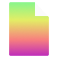

# Flax-Editor-Icons

Ever-growing repository of [Flax Engine](https://github.com/FlaxEngine/FlaxEngine) icons.

## Icons

|Actions|
|-----------------------|
| [AddActor](./Icons/Actions/Action=AddActor.png)| [Duplicate](./Icons/Actions/Action=Duplicate.png)| [Animation7](./Icons/Actions/Animation=Animation7.png)| [Mute](./Icons/Actions/Animation=Mute.png)| [Pause](./Icons/Actions/Animation=Pause.png)| [Play](./Icons/Actions/Animation=Play.png)|
| [Record](./Icons/Actions/Animation=Record.png)| [Solo](./Icons/Actions/Animation=Solo.png)| [StepBackward](./Icons/Actions/Animation=StepBackward.png)| [StepForward](./Icons/Actions/Animation=StepForward.png)| [Add](./Icons/Actions/Generic=Add.png)| [Backward](./Icons/Actions/Generic=Backward.png)|
| [Down](./Icons/Actions/Generic=Down.png)| [Forward](./Icons/Actions/Generic=Forward.png)| [Hammer](./Icons/Actions/Generic=Hammer.png)| [HammerBox](./Icons/Actions/Generic=HammerBox.png)| [HammerGrid](./Icons/Actions/Generic=HammerGrid.png)| [HammerGridPersp](./Icons/Actions/Generic=HammerGridPersp.png)|
| [OpenFolder](./Icons/Actions/Generic=OpenFolder.png)| [Package](./Icons/Actions/Generic=Package.png)| [Redo](./Icons/Actions/Generic=Redo.png)| [Remove](./Icons/Actions/Generic=Remove.png)| [Save](./Icons/Actions/Generic=Save.png)| [Search](./Icons/Actions/Generic=Search.png)|
| [Undo](./Icons/Actions/Generic=Undo.png)| [Up](./Icons/Actions/Generic=Up.png)| [Accent](./Icons/Actions/Terrain=Accent.png)| [Hole](./Icons/Actions/Terrain=Hole.png)| [Noise](./Icons/Actions/Terrain=Noise.png)| [Sculpt](./Icons/Actions/Terrain=Sculpt.png)|
| [SetHeight](./Icons/Actions/Terrain=SetHeight.png)| [Smooth](./Icons/Actions/Terrain=Smooth.png)| | | | |

|Actors|
|-----------------------|
| [Actor Volume](./Icons/Actors/Actor=Actor%20Volume.png)| [Actor](./Icons/Actors/Actor=Actor.png)| [Grid_Env](./Icons/Actors/Actor=Grid_Env.png)| [Grid_Env_Flat](./Icons/Actors/Actor=Grid_Env_Flat.png)| [Model](./Icons/Actors/Actor=Model.png)| [Prefab](./Icons/Actors/Actor=Prefab.png)|
| [Skinned Model](./Icons/Actors/Actor=Skinned%20Model.png)| [Transform](./Icons/Actors/Actor=Transform.png)| [Audio Listener](./Icons/Actors/Audio=Audio%20Listener.png)| [Audio Source](./Icons/Actors/Audio=Audio%20Source.png)| [Directional Light](./Icons/Actors/Lighting=Directional%20Light.png)| [Environment Light](./Icons/Actors/Lighting=Environment%20Light.png)|
| [Point Light](./Icons/Actors/Lighting=Point%20Light.png)| [Reflection Probe](./Icons/Actors/Lighting=Reflection%20Probe.png)| [Spot Light](./Icons/Actors/Lighting=Spot%20Light.png)| [Directional Light](./Icons/Actors/Lighting_White=Directional%20Light.png)| [Environment Light](./Icons/Actors/Lighting_White=Environment%20Light.png)| [Point Light](./Icons/Actors/Lighting_White=Point%20Light.png)|
| [SpotLight](./Icons/Actors/Lighting_White=SpotLight.png)| [MovieReel](./Icons/Actors/Misc=MovieReel.png)| [Spline](./Icons/Actors/Misc=Spline.png)| [Timeline](./Icons/Actors/Misc=Timeline.png)| [Landmark](./Icons/Actors/Navigation=Landmark.png)| [Modify](./Icons/Actors/Navigation=Modify.png)|
| [NavMesh Agent](./Icons/Actors/Navigation=NavMesh%20Agent.png)| [NavMesh Link](./Icons/Actors/Navigation=NavMesh%20Link.png)| [NavMesh Modifier](./Icons/Actors/Navigation=NavMesh%20Modifier.png)| [NavMesh](./Icons/Actors/Navigation=NavMesh.png)| [Bone](./Icons/Actors/Physics=Bone.png)| [Collider](./Icons/Actors/Physics=Collider.png)|
| [FragileBox](./Icons/Actors/Physics=FragileBox.png)| [FragileGlass](./Icons/Actors/Physics=FragileGlass.png)| [MeshCollider](./Icons/Actors/Physics=MeshCollider.png)| [PostFX](./Icons/Actors/Post=PostFX.png)| [Camera](./Icons/Actors/Rendering=Camera.png)| [Decals](./Icons/Actors/Rendering=Decals.png)|
| [ParticleFX](./Icons/Actors/Rendering=ParticleFX.png)| [VideoPlayer](./Icons/Actors/Rendering=VideoPlayer.png)| [Height Fog](./Icons/Actors/Sky=Height%20Fog.png)| [Sky](./Icons/Actors/Sky=Sky.png)| [Skybox](./Icons/Actors/Sky=Skybox.png)| [Button](./Icons/Actors/UI=Button.png)|
| [Canvas](./Icons/Actors/UI=Canvas.png)| [Dropdown](./Icons/Actors/UI=Dropdown.png)| [Grid](./Icons/Actors/UI=Grid.png)| [Horizontal](./Icons/Actors/UI=Horizontal.png)| [Image](./Icons/Actors/UI=Image.png)| [Label](./Icons/Actors/UI=Label.png)|
| [ProgressBar](./Icons/Actors/UI=ProgressBar.png)| [Slider](./Icons/Actors/UI=Slider.png)| [TextField](./Icons/Actors/UI=TextField.png)| [Vertical](./Icons/Actors/UI=Vertical.png)| [AmbianceVolume](./Icons/Actors/Volume=AmbianceVolume.png)| [Fog Volume](./Icons/Actors/Volume=Fog%20Volume.png)|
| [PostFX](./Icons/Actors/Volume=PostFX.png)| [VolumeEmpty](./Icons/Actors/Volume=VolumeEmpty.png)| | | | |

|Files|
|-----------------------|
| [Build Config Android](./Icons/Files/File_Build=Build%20Config%20Android.png)| [Build Config IOS](./Icons/Files/File_Build=Build%20Config%20IOS.png)| [Build Config Mac](./Icons/Files/File_Build=Build%20Config%20Mac.png)| [Build Config PS4](./Icons/Files/File_Build=Build%20Config%20PS4.png)| [Build Config PS5](./Icons/Files/File_Build=Build%20Config%20PS5.png)| [Build Config Switch](./Icons/Files/File_Build=Build%20Config%20Switch.png)|
| [Build Config Win](./Icons/Files/File_Build=Build%20Config%20Win.png)| [Build Config XOne](./Icons/Files/File_Build=Build%20Config%20XOne.png)| [Build Config XX](./Icons/Files/File_Build=Build%20Config%20XX.png)| [File](./Icons/Files/File_Container=File.png)| [Flax_Logo](./Icons/Files/File_Container=Flax_Logo.png)| [Folder](./Icons/Files/File_Container=Folder.png)|
| [JSON Script Instance](./Icons/Files/File_Container=JSON%20Script%20Instance.png)| [Module](./Icons/Files/File_Container=Module.png)| [Audio](./Icons/Files/File_Content=Audio.png)| [Bin](./Icons/Files/File_Content=Bin.png)| [Brackets](./Icons/Files/File_Content=Brackets.png)| [Build](./Icons/Files/File_Content=Build.png)|
| [Flax](./Icons/Files/File_Content=Flax.png)| [Markup](./Icons/Files/File_Content=Markup.png)| [Shader](./Icons/Files/File_Content=Shader.png)| [String](./Icons/Files/File_Content=String.png)| [AudioClip](./Icons/Files/File_DataType=AudioClip.png)| [Binary File](./Icons/Files/File_DataType=Binary%20File.png)|
| [C#](./Icons/Files/File_DataType=C#.png)| [CPP](./Icons/Files/File_DataType=CPP.png)| [JSON](./Icons/Files/File_DataType=JSON.png)| [Markdown](./Icons/Files/File_DataType=Markdown.png)| [Shader HLSL](./Icons/Files/File_DataType=Shader%20HLSL.png)| [Text File](./Icons/Files/File_DataType=Text%20File.png)|
| [XML](./Icons/Files/File_DataType=XML.png)| [Flax](./Icons/Files/File_FlaxSetting=Flax.png)| | | | |

|Platforms|
|-----------------------|
| [Android](./Icons/Platforms/Platform=Android.png)| [Apple Ios](./Icons/Platforms/Platform=Apple%20Ios.png)| [Mac](./Icons/Platforms/Platform=Mac.png)| [PS4](./Icons/Platforms/Platform=PS4.png)| [PS5](./Icons/Platforms/Platform=PS5.png)| [Switch](./Icons/Platforms/Platform=Switch.png)|
| [Win](./Icons/Platforms/Platform=Win.png)| [Xbox One](./Icons/Platforms/Platform=Xbox%20One.png)| [Xbox X](./Icons/Platforms/Platform=Xbox%20X.png)| | | |

