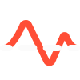

# Flax-Editor-Icons

Ever-growing repository of [Flax Engine](https://github.com/FlaxEngine/FlaxEngine) icons.

## Icons

| Actions ||||||
|:---:|:---:|:---:|:---:|:---:|:---:|
|  [AddActor](./Icons/Actions/Action=AddActor.png) |  [Duplicate](./Icons/Actions/Action=Duplicate.png) |  [Add](./Icons/Actions/Generic=Add.png) |  [Backward](./Icons/Actions/Generic=Backward.png) |  [Brush](./Icons/Actions/Generic=Brush.png) |  [Cook](./Icons/Actions/Generic=Cook.png) |
|  [Down](./Icons/Actions/Generic=Down.png) |  [Forward](./Icons/Actions/Generic=Forward.png) |  [Hammer](./Icons/Actions/Generic=Hammer.png) |  [HammerBox](./Icons/Actions/Generic=HammerBox.png) |  [HammerGrid](./Icons/Actions/Generic=HammerGrid.png) |  [HammerGridPersp](./Icons/Actions/Generic=HammerGridPersp.png) |
|  [Manual](./Icons/Actions/Generic=Manual.png) |  [Move](./Icons/Actions/Generic=Move.png) |  [OpenFolder](./Icons/Actions/Generic=OpenFolder.png) |  [Package_Export](./Icons/Actions/Generic=Package_Export.png) |  [PinAsset](./Icons/Actions/Generic=PinAsset.png) |  [Redo](./Icons/Actions/Generic=Redo.png) |
|  [RefreshRotate](./Icons/Actions/Generic=RefreshRotate.png) |  [Remove](./Icons/Actions/Generic=Remove.png) |  [Rotate2](./Icons/Actions/Generic=Rotate2.png) |  [Save](./Icons/Actions/Generic=Save.png) |  [Scale](./Icons/Actions/Generic=Scale.png) |  [Search](./Icons/Actions/Generic=Search.png) |
|  [Undo](./Icons/Actions/Generic=Undo.png) |  [Up](./Icons/Actions/Generic=Up.png) |  [Write](./Icons/Actions/Generic=Write.png) |  [Accent](./Icons/Actions/Terrain=Accent.png) |  [Hole](./Icons/Actions/Terrain=Hole.png) |  [Noise](./Icons/Actions/Terrain=Noise.png) |
|  [Sculpt](./Icons/Actions/Terrain=Sculpt.png) |  [SetHeight](./Icons/Actions/Terrain=SetHeight.png) |  [Smooth](./Icons/Actions/Terrain=Smooth.png) |   |   |   |

| Actions/Animation ||||||
|:---:|:---:|:---:|:---:|:---:|:---:|
|  [Keyframe](./Icons/Actions/Animation/Playback=Keyframe.png) |  [KeyframeAdd](./Icons/Actions/Animation/Playback=KeyframeAdd.png) |  [Mute](./Icons/Actions/Animation/Playback=Mute.png) |  [NextKey](./Icons/Actions/Animation/Playback=NextKey.png) |  [Pause](./Icons/Actions/Animation/Playback=Pause.png) |  [Play](./Icons/Actions/Animation/Playback=Play.png) |
|  [PreviousKey](./Icons/Actions/Animation/Playback=PreviousKey.png) |  [Record](./Icons/Actions/Animation/Playback=Record.png) |  [Remove](./Icons/Actions/Animation/Playback=Remove.png) |  [Render](./Icons/Actions/Animation/Playback=Render.png) |  [Solo](./Icons/Actions/Animation/Playback=Solo.png) |  [StepBackward](./Icons/Actions/Animation/Playback=StepBackward.png) |
|  [StepForward](./Icons/Actions/Animation/Playback=StepForward.png) |  [Stop](./Icons/Actions/Animation/Playback=Stop.png) |   |   |   |   |

| Actors ||||||
|:---:|:---:|:---:|:---:|:---:|:---:|
|  [Actor](./Icons/Actors/Actor=Actor.png) |  [ActorVolume](./Icons/Actors/Actor=ActorVolume.png) |  [GridEnv](./Icons/Actors/Actor=GridEnv.png) |  [GridEnvFlat](./Icons/Actors/Actor=GridEnvFlat.png) |  [Model](./Icons/Actors/Actor=Model.png) |  [Prefab](./Icons/Actors/Actor=Prefab.png) |
|  [SkinnedModel](./Icons/Actors/Actor=SkinnedModel.png) |  [Transform](./Icons/Actors/Actor=Transform.png) |  [AudioListener](./Icons/Actors/Audio=AudioListener.png) |  [AudioSource](./Icons/Actors/Audio=AudioSource.png) |  [Listener](./Icons/Actors/Audio=Listener.png) |  [No Sound](./Icons/Actors/Audio=No%20Sound.png) |
|  [Sound](./Icons/Actors/Audio=Sound.png) |  [DirectionalLight](./Icons/Actors/Lighting=DirectionalLight.png) |  [EnvironmentLight](./Icons/Actors/Lighting=EnvironmentLight.png) |  [PointLight](./Icons/Actors/Lighting=PointLight.png) |  [ReflectionProbe](./Icons/Actors/Lighting=ReflectionProbe.png) |  [SpotLight](./Icons/Actors/Lighting=SpotLight.png) |
|  [DirectionalLight](./Icons/Actors/Lighting_White=DirectionalLight.png) |  [EnvironmentLight](./Icons/Actors/Lighting_White=EnvironmentLight.png) |  [PointLight](./Icons/Actors/Lighting_White=PointLight.png) |  [SpotLight](./Icons/Actors/Lighting_White=SpotLight.png) |  [MovieReel](./Icons/Actors/Misc=MovieReel.png) |  [Spline](./Icons/Actors/Misc=Spline.png) |
|  [Timeline](./Icons/Actors/Misc=Timeline.png) |  [Landmark](./Icons/Actors/Navigation=Landmark.png) |  [NavMesh](./Icons/Actors/Navigation=NavMesh.png) |  [NavMeshAgent](./Icons/Actors/Navigation=NavMeshAgent.png) |  [NavMeshLink](./Icons/Actors/Navigation=NavMeshLink.png) |  [NavMeshModifier](./Icons/Actors/Navigation=NavMeshModifier.png) |
|  [Bone](./Icons/Actors/Physics=Bone.png) |  [Collider](./Icons/Actors/Physics=Collider.png) |  [FragileBox](./Icons/Actors/Physics=FragileBox.png) |  [FragileGlass](./Icons/Actors/Physics=FragileGlass.png) |  [MeshCollider](./Icons/Actors/Physics=MeshCollider.png) |  [PostFX](./Icons/Actors/Post=PostFX.png) |
|  [Camera](./Icons/Actors/Rendering=Camera.png) |  [Decals](./Icons/Actors/Rendering=Decals.png) |  [ParticleFX](./Icons/Actors/Rendering=ParticleFX.png) |  [VideoPlayer](./Icons/Actors/Rendering=VideoPlayer.png) |  [HeightFog](./Icons/Actors/Sky=HeightFog.png) |  [Sky](./Icons/Actors/Sky=Sky.png) |
|  [Skybox](./Icons/Actors/Sky=Skybox.png) |  [TerrainActor](./Icons/Actors/Terrain=TerrainActor.png) |  [Button](./Icons/Actors/UI=Button.png) |  [Canvas](./Icons/Actors/UI=Canvas.png) |  [Dropdown](./Icons/Actors/UI=Dropdown.png) |  [Grid](./Icons/Actors/UI=Grid.png) |
|  [Horizontal](./Icons/Actors/UI=Horizontal.png) |  [Image](./Icons/Actors/UI=Image.png) |  [Label](./Icons/Actors/UI=Label.png) |  [ProgressBar](./Icons/Actors/UI=ProgressBar.png) |  [Slider](./Icons/Actors/UI=Slider.png) |  [TextField](./Icons/Actors/UI=TextField.png) |
|  [Vertical](./Icons/Actors/UI=Vertical.png) |  [AmbianceVolume](./Icons/Actors/Volume=AmbianceVolume.png) |  [FogVolume](./Icons/Actors/Volume=FogVolume.png) |  [PostFX](./Icons/Actors/Volume=PostFX.png) |  [VolumeEmpty](./Icons/Actors/Volume=VolumeEmpty.png) |   |

| Files ||||||
|:---:|:---:|:---:|:---:|:---:|:---:|
|  [Build Config Android](./Icons/Files/File_Build=Build%20Config%20Android.png) |  [Build Config IOS](./Icons/Files/File_Build=Build%20Config%20IOS.png) |  [Build Config Mac](./Icons/Files/File_Build=Build%20Config%20Mac.png) |  [Build Config PS4](./Icons/Files/File_Build=Build%20Config%20PS4.png) |  [Build Config PS5](./Icons/Files/File_Build=Build%20Config%20PS5.png) |  [Build Config Switch](./Icons/Files/File_Build=Build%20Config%20Switch.png) |
|  [Build Config Win](./Icons/Files/File_Build=Build%20Config%20Win.png) |  [Build Config XOne](./Icons/Files/File_Build=Build%20Config%20XOne.png) |  [Build Config XX](./Icons/Files/File_Build=Build%20Config%20XX.png) |  [EmptyFolder](./Icons/Files/File_Container=EmptyFolder.png) |  [File](./Icons/Files/File_Container=File.png) |  [FlaxLogo](./Icons/Files/File_Container=FlaxLogo.png) |
|  [FlaxLogoBlue](./Icons/Files/File_Container=FlaxLogoBlue.png) |  [Folder](./Icons/Files/File_Container=Folder.png) |  [JSONScriptInstance](./Icons/Files/File_Container=JSONScriptInstance.png) |  [Module](./Icons/Files/File_Container=Module.png) |  [Audio](./Icons/Files/File_Content=Audio.png) |  [Bin](./Icons/Files/File_Content=Bin.png) |
|  [Brackets](./Icons/Files/File_Content=Brackets.png) |  [Build](./Icons/Files/File_Content=Build.png) |  [Flax](./Icons/Files/File_Content=Flax.png) |  [Markup](./Icons/Files/File_Content=Markup.png) |  [Shader](./Icons/Files/File_Content=Shader.png) |  [String](./Icons/Files/File_Content=String.png) |
|  [AudioClip](./Icons/Files/File_DataType=AudioClip.png) |  [BinaryFile](./Icons/Files/File_DataType=BinaryFile.png) |  [C#](./Icons/Files/File_DataType=C#.png) |  [CPP](./Icons/Files/File_DataType=CPP.png) |  [JSON](./Icons/Files/File_DataType=JSON.png) |  [Markdown](./Icons/Files/File_DataType=Markdown.png) |
|  [ShaderHLSL](./Icons/Files/File_DataType=ShaderHLSL.png) |  [TextFile](./Icons/Files/File_DataType=TextFile.png) |  [XML](./Icons/Files/File_DataType=XML.png) |  [Flax](./Icons/Files/File_FlaxSetting=Flax.png) |   |   |

| Platforms ||||||
|:---:|:---:|:---:|:---:|:---:|:---:|
|  [Android](./Icons/Platforms/Platform=Android.png) |  [Apple](./Icons/Platforms/Platform=Apple.png) |  [AppleIos](./Icons/Platforms/Platform=AppleIos.png) |  [Mac](./Icons/Platforms/Platform=Mac.png) |  [PS4](./Icons/Platforms/Platform=PS4.png) |  [PS5](./Icons/Platforms/Platform=PS5.png) |
|  [Switch](./Icons/Platforms/Platform=Switch.png) |  [Win](./Icons/Platforms/Platform=Win.png) |  [XboxOne](./Icons/Platforms/Platform=XboxOne.png) |  [XboxX](./Icons/Platforms/Platform=XboxX.png) |   |   |

| Tabs ||||||
|:---:|:---:|:---:|:---:|:---:|:---:|
|  [Actor](./Icons/Tabs/General=Actor.png) |  [Browser](./Icons/Tabs/General=Browser.png) |  [Content Empty](./Icons/Tabs/General=Content%20Empty.png) |  [Content](./Icons/Tabs/General=Content.png) |  [ContentOpen](./Icons/Tabs/General=ContentOpen.png) |  [ContentOpenFull](./Icons/Tabs/General=ContentOpenFull.png) |
|  [Cooker](./Icons/Tabs/General=Cooker.png) |  [DebugLog](./Icons/Tabs/General=DebugLog.png) |  [Help](./Icons/Tabs/General=Help.png) |  [OutputLog](./Icons/Tabs/General=OutputLog.png) |  [Profiler](./Icons/Tabs/General=Profiler.png) |  [Scene](./Icons/Tabs/General=Scene.png) |
|  [Settings](./Icons/Tabs/General=Settings.png) |  [Timeline](./Icons/Tabs/General=Timeline.png) |   |   |   |   |

