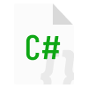

# Flax-Editor-Icons

Ever-growing repository of [Flax Engine](https://github.com/FlaxEngine/FlaxEngine) icons.

### Actions

     
    <a href="./Icons/Actions/Action=AddActor.png">AddActor</a>

     
    <a href="./Icons/Actions/Action=Duplicate.png">Duplicate</a>

     
    <a href="./Icons/Actions/Animation=Mute.png">Mute</a>

     
    <a href="./Icons/Actions/Animation=Pause.png">Pause</a>

     
    <a href="./Icons/Actions/Animation=Play.png">Play</a>

     
    <a href="./Icons/Actions/Animation=Record.png">Record</a>

     
    <a href="./Icons/Actions/Animation=Solo.png">Solo</a>

     
    <a href="./Icons/Actions/Animation=StepBackward.png">StepBackward</a>

     
    <a href="./Icons/Actions/Animation=StepForward.png">StepForward</a>

     
    <a href="./Icons/Actions/Animation=Stop.png">Stop</a>

     
    <a href="./Icons/Actions/Generic=Add.png">Add</a>

     
    <a href="./Icons/Actions/Generic=Backward.png">Backward</a>

     
    <a href="./Icons/Actions/Generic=Down.png">Down</a>

     
    <a href="./Icons/Actions/Generic=Forward.png">Forward</a>

     
    <a href="./Icons/Actions/Generic=Hammer.png">Hammer</a>

     
    <a href="./Icons/Actions/Generic=HammerBox.png">HammerBox</a>

     
    <a href="./Icons/Actions/Generic=HammerGrid.png">HammerGrid</a>

     
    <a href="./Icons/Actions/Generic=HammerGridPersp.png">HammerGridPersp</a>

     
    <a href="./Icons/Actions/Generic=OpenFolder.png">OpenFolder</a>

     
    <a href="./Icons/Actions/Generic=Package.png">Package</a>

     
    <a href="./Icons/Actions/Generic=Redo.png">Redo</a>

     
    <a href="./Icons/Actions/Generic=Remove.png">Remove</a>

     
    <a href="./Icons/Actions/Generic=Save.png">Save</a>

     
    <a href="./Icons/Actions/Generic=Search.png">Search</a>

     
    <a href="./Icons/Actions/Generic=Undo.png">Undo</a>

     
    <a href="./Icons/Actions/Generic=Up.png">Up</a>

     
    <a href="./Icons/Actions/Terrain=Accent.png">Accent</a>

     
    <a href="./Icons/Actions/Terrain=Hole.png">Hole</a>

     
    <a href="./Icons/Actions/Terrain=Noise.png">Noise</a>

     
    <a href="./Icons/Actions/Terrain=Sculpt.png">Sculpt</a>

     
    <a href="./Icons/Actions/Terrain=SetHeight.png">SetHeight</a>

     
    <a href="./Icons/Actions/Terrain=Smooth.png">Smooth</a>

### Actors

     
    <a href="./Icons/Actors/Actor=Actor.png">Actor</a>

     
    <a href="./Icons/Actors/Actor=ActorVolume.png">ActorVolume</a>

     
    <a href="./Icons/Actors/Actor=GridEnv.png">GridEnv</a>

     
    <a href="./Icons/Actors/Actor=GridEnvFlat.png">GridEnvFlat</a>

     
    <a href="./Icons/Actors/Actor=Model.png">Model</a>

     
    <a href="./Icons/Actors/Actor=Prefab.png">Prefab</a>

     
    <a href="./Icons/Actors/Actor=SkinnedModel.png">SkinnedModel</a>

     
    <a href="./Icons/Actors/Actor=Transform.png">Transform</a>

     
    <a href="./Icons/Actors/Audio=AudioListener.png">AudioListener</a>

     
    <a href="./Icons/Actors/Audio=AudioSource.png">AudioSource</a>

     
    <a href="./Icons/Actors/Lighting=DirectionalLight.png">DirectionalLight</a>

     
    <a href="./Icons/Actors/Lighting=EnvironmentLight.png">EnvironmentLight</a>

     
    <a href="./Icons/Actors/Lighting=PointLight.png">PointLight</a>

     
    <a href="./Icons/Actors/Lighting=ReflectionProbe.png">ReflectionProbe</a>

     
    <a href="./Icons/Actors/Lighting=SpotLight.png">SpotLight</a>

     
    <a href="./Icons/Actors/Lighting_White=DirectionalLight.png">DirectionalLight</a>

     
    <a href="./Icons/Actors/Lighting_White=EnvironmentLight.png">EnvironmentLight</a>

     
    <a href="./Icons/Actors/Lighting_White=PointLight.png">PointLight</a>

     
    <a href="./Icons/Actors/Lighting_White=SpotLight.png">SpotLight</a>

     
    <a href="./Icons/Actors/Misc=MovieReel.png">MovieReel</a>

     
    <a href="./Icons/Actors/Misc=Spline.png">Spline</a>

     
    <a href="./Icons/Actors/Misc=Timeline.png">Timeline</a>

     
    <a href="./Icons/Actors/Navigation=Landmark.png">Landmark</a>

     
    <a href="./Icons/Actors/Navigation=Modify.png">Modify</a>

     
    <a href="./Icons/Actors/Navigation=NavMesh.png">NavMesh</a>

     
    <a href="./Icons/Actors/Navigation=NavMeshAgent.png">NavMeshAgent</a>

     
    <a href="./Icons/Actors/Navigation=NavMeshLink.png">NavMeshLink</a>

     
    <a href="./Icons/Actors/Navigation=NavMeshModifier.png">NavMeshModifier</a>

     
    <a href="./Icons/Actors/Physics=Bone.png">Bone</a>

     
    <a href="./Icons/Actors/Physics=Collider.png">Collider</a>

     
    <a href="./Icons/Actors/Physics=FragileBox.png">FragileBox</a>

     
    <a href="./Icons/Actors/Physics=FragileGlass.png">FragileGlass</a>

     
    <a href="./Icons/Actors/Physics=MeshCollider.png">MeshCollider</a>

     
    <a href="./Icons/Actors/Post=PostFX.png">PostFX</a>

     
    <a href="./Icons/Actors/Rendering=Camera.png">Camera</a>

     
    <a href="./Icons/Actors/Rendering=Decals.png">Decals</a>

     
    <a href="./Icons/Actors/Rendering=ParticleFX.png">ParticleFX</a>

     
    <a href="./Icons/Actors/Rendering=VideoPlayer.png">VideoPlayer</a>

     
    <a href="./Icons/Actors/Sky=HeightFog.png">HeightFog</a>

     
    <a href="./Icons/Actors/Sky=Sky.png">Sky</a>

     
    <a href="./Icons/Actors/Sky=Skybox.png">Skybox</a>

     
    <a href="./Icons/Actors/UI=Button.png">Button</a>

     
    <a href="./Icons/Actors/UI=Canvas.png">Canvas</a>

     
    <a href="./Icons/Actors/UI=Dropdown.png">Dropdown</a>

     
    <a href="./Icons/Actors/UI=Grid.png">Grid</a>

     
    <a href="./Icons/Actors/UI=Horizontal.png">Horizontal</a>

     
    <a href="./Icons/Actors/UI=Image.png">Image</a>

     
    <a href="./Icons/Actors/UI=Label.png">Label</a>

     
    <a href="./Icons/Actors/UI=ProgressBar.png">ProgressBar</a>

     
    <a href="./Icons/Actors/UI=Slider.png">Slider</a>

     
    <a href="./Icons/Actors/UI=TextField.png">TextField</a>

     
    <a href="./Icons/Actors/UI=Vertical.png">Vertical</a>

     
    <a href="./Icons/Actors/Volume=AmbianceVolume.png">AmbianceVolume</a>

     
    <a href="./Icons/Actors/Volume=FogVolume.png">FogVolume</a>

     
    <a href="./Icons/Actors/Volume=PostFX.png">PostFX</a>

     
    <a href="./Icons/Actors/Volume=VolumeEmpty.png">VolumeEmpty</a>

### Files

     
    <a href="./Icons/Files/File_Build=Build%20Config%20Android.png">Build Config Android</a>

     
    <a href="./Icons/Files/File_Build=Build%20Config%20IOS.png">Build Config IOS</a>

     
    <a href="./Icons/Files/File_Build=Build%20Config%20Mac.png">Build Config Mac</a>

     
    <a href="./Icons/Files/File_Build=Build%20Config%20PS4.png">Build Config PS4</a>

     
    <a href="./Icons/Files/File_Build=Build%20Config%20PS5.png">Build Config PS5</a>

     
    <a href="./Icons/Files/File_Build=Build%20Config%20Switch.png">Build Config Switch</a>

     
    <a href="./Icons/Files/File_Build=Build%20Config%20Win.png">Build Config Win</a>

     
    <a href="./Icons/Files/File_Build=Build%20Config%20XOne.png">Build Config XOne</a>

     
    <a href="./Icons/Files/File_Build=Build%20Config%20XX.png">Build Config XX</a>

     
    <a href="./Icons/Files/File_Container=File.png">File</a>

     
    <a href="./Icons/Files/File_Container=FlaxLogo.png">FlaxLogo</a>

     
    <a href="./Icons/Files/File_Container=Folder.png">Folder</a>

     
    <a href="./Icons/Files/File_Container=JSONScriptInstance.png">JSONScriptInstance</a>

     
    <a href="./Icons/Files/File_Container=Module.png">Module</a>

     
    <a href="./Icons/Files/File_Content=Audio.png">Audio</a>

     
    <a href="./Icons/Files/File_Content=Bin.png">Bin</a>

     
    <a href="./Icons/Files/File_Content=Brackets.png">Brackets</a>

     
    <a href="./Icons/Files/File_Content=Build.png">Build</a>

     
    <a href="./Icons/Files/File_Content=Flax.png">Flax</a>

     
    <a href="./Icons/Files/File_Content=Markup.png">Markup</a>

     
    <a href="./Icons/Files/File_Content=Shader.png">Shader</a>

     
    <a href="./Icons/Files/File_Content=String.png">String</a>

     
    <a href="./Icons/Files/File_DataType=AudioClip.png">AudioClip</a>

     
    <a href="./Icons/Files/File_DataType=BinaryFile.png">BinaryFile</a>

     
    <a href="./Icons/Files/File_DataType=C#.png">C#</a>

     
    <a href="./Icons/Files/File_DataType=CPP.png">CPP</a>

     
    <a href="./Icons/Files/File_DataType=JSON.png">JSON</a>

     
    <a href="./Icons/Files/File_DataType=Markdown.png">Markdown</a>

     
    <a href="./Icons/Files/File_DataType=ShaderHLSL.png">ShaderHLSL</a>

     
    <a href="./Icons/Files/File_DataType=TextFile.png">TextFile</a>

     
    <a href="./Icons/Files/File_DataType=XML.png">XML</a>

     
    <a href="./Icons/Files/File_FlaxSetting=Flax.png">Flax</a>

### Icons

### Platforms

     
    <a href="./Icons/Platforms/Platform=Android.png">Android</a>

     
    <a href="./Icons/Platforms/Platform=AppleIos.png">AppleIos</a>

     
    <a href="./Icons/Platforms/Platform=Mac.png">Mac</a>

     
    <a href="./Icons/Platforms/Platform=PS4.png">PS4</a>

     
    <a href="./Icons/Platforms/Platform=PS5.png">PS5</a>

     
    <a href="./Icons/Platforms/Platform=Switch.png">Switch</a>

     
    <a href="./Icons/Platforms/Platform=Win.png">Win</a>

     
    <a href="./Icons/Platforms/Platform=XboxOne.png">XboxOne</a>

     
    <a href="./Icons/Platforms/Platform=XboxX.png">XboxX</a>

